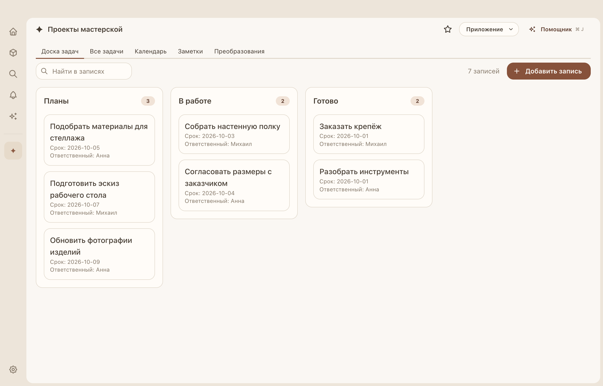
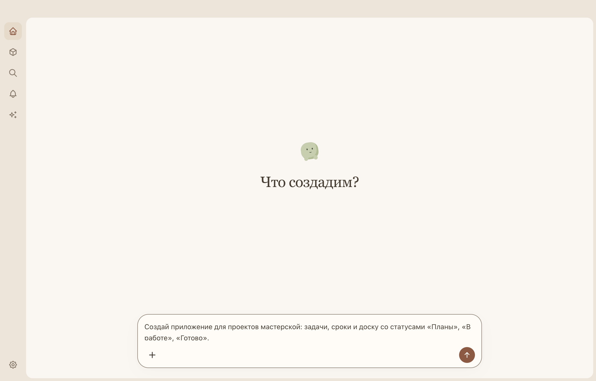
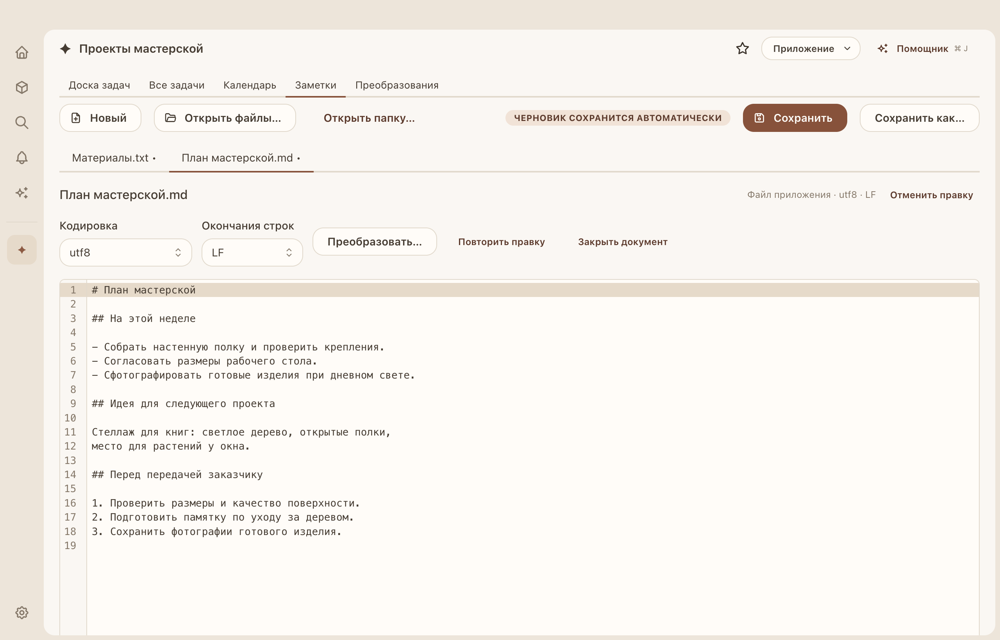
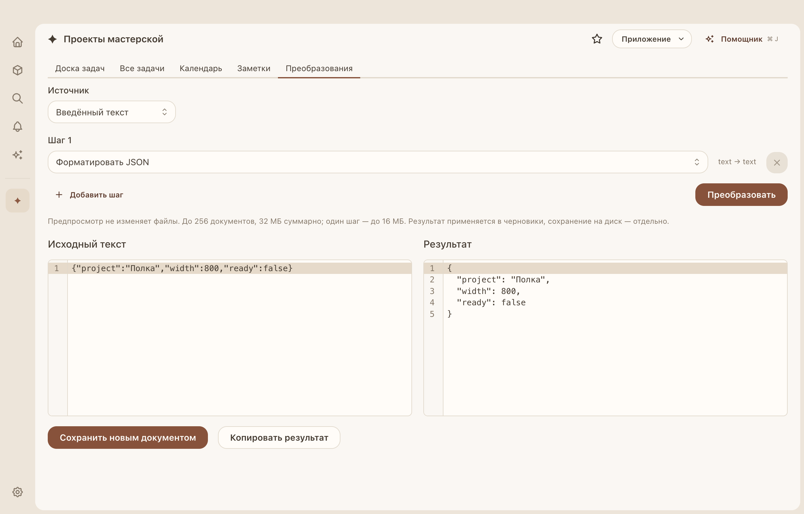

# Everything App

Персональные приложения для ваших задач — на вашем Mac. Создайте учёт проектов, каталог вещей или рабочий инструмент: опишите идею AI-помощнику либо соберите приложение вручную. Данные и документы сохраняются локально, а готовым приложением можно поделиться через файл `.everyapp`.

**macOS 27+ · Apple silicon · Интерфейс на русском · MIT**



_Пример приложения с демонстрационными данными. Доска, таблица, календарь и заметки находятся в одном рабочем пространстве._

Проект активно развивается. Сейчас доступна локальная сборка; подписанный выпуск и обновление между реальными выпусками ещё требуют проверки. [Текущее состояние и ограничения](docs/validation.md).

## Что можно делать

- **Организовать свои данные.** Добавляйте поля и записи, ищите и сортируйте их. Показывайте одни и те же данные в таблице, на доске, в календаре или на диаграмме.
- **Создавать и менять приложения с помощником.** Опишите задачу обычными словами, затем попросите добавить экран, поле или действие в уже открытое приложение.
- **Работать с файлами.** Открывайте текстовые документы и изображения, редактируйте черновики, применяйте преобразования и сохраняйте результат.
- **Держать нужное под рукой.** Откройте приложение в отдельном или компактном окне либо как панель поверх других окон.
- **Автоматизировать повторяющиеся действия.** Настраивайте правила по расписанию и событиям; результаты и ошибки видны во «Входящих и фоновых задачах».
- **Делиться приложениями.** Экспортируйте шаблон без личных данных или выберите записи и вложения для передачи. Импорт создаёт независимую копию.

Таблицы, документы, редактор изображений и преобразования работают без AI и без подключения к сети. Помощнику нужен настроенный провайдер с моделью, поддерживающей инструменты.

## Установка и запуск

Для запуска из исходников нужны **Node.js 24.18+**, **npm 11** и **Xcode Command Line Tools** на Mac с Apple silicon и macOS 27 или новее. Выполните команды в папке проекта:

```sh
npm ci
npm run native:build
npm run dev
```

Чтобы получить обычное приложение для macOS:

```sh
npm run package
```

Сборка создаёт DMG и ZIP в `release/`, а также `release/mac-arm64/Everything App.app`. Откройте DMG и перенесите приложение в «Программы». Готовому приложению Node.js, npm и Command Line Tools не нужны. Локальная сборка не является проверенным подписанным выпуском; подробности — в [руководстве по macOS и выпуску](docs/macos.md).

## Первое приложение

### С AI-помощником

1. Откройте **«Настройки» → «Подключение AI»**. Выберите **OpenAI / совместимый API** или **Anthropic**, укажите адрес API, свой ключ и модель.
2. Нажмите **«Проверить и получить модели»**. Если модель ещё не выбрана, выберите её и повторите проверку. Проверка выполняет небольшой запрос к провайдеру.
3. На главной опишите, что хотите создать, и нажмите стрелку отправки или **Enter**. Для новой строки используйте **Shift+Enter**. Например:

   > Создай приложение для проектов мастерской: задачи, сроки и доску со статусами «Планы», «В работе», «Готово».

4. Откройте созданное приложение через боковую панель. Чтобы изменить его, откройте **«Помощник»** или нажмите **⌘ J** и опишите следующую задачу: «Добавь поле стоимости и диаграмму расходов».



_Главная — место, где можно начать с описания своей задачи. На скриншоте запрос ещё не отправлен._

### Без AI

1. На главной нажмите **«+» → «Создать вручную…»**, укажите название и назначение приложения.
2. В открытом приложении выберите **«Приложение» → «Изменить экраны и данные»**. Добавьте структуру данных, поля и нужные экраны.
3. Проверьте изменения и нажмите **«Применить новую версию»**, затем добавьте первую запись.

Если у вас уже есть файл `.everyapp`, выберите **«+» → «Открыть файл приложения…»**. Перед импортом можно проверить состав пакета и требуемые разрешения. Права отправителя не переносятся — доступ для своей копии вы выдаёте отдельно.

## Документы и преобразования

В приложении с текстовым экраном можно открыть несколько файлов, целую папку или перетащить файлы в окно. Переключайтесь между вкладками, редактируйте текст, выбирайте кодировку и окончания строк. Черновики сохраняются локально; запись изменений в исходный файл выполняется через сохранение.



Преобразования работают с введённым текстом, выделением, текущим документом, буфером обмена или выбранными открытыми файлами. Соберите цепочку шагов, посмотрите результат и примените его в черновик либо сохраните новым документом. Доступны Base64, JSON, XML, кодировки и операции с PNG.



Для изображений есть кисть, ластик, обрезка, изменение размера, поворот, отражение и отмена изменений. Подробнее о форматах и пределах — в [руководстве по документам и редакторам](docs/document-workflows.md).

## Ваши данные и доступ

Приложения, записи, черновики и история хранятся в локальном профиле. При использовании AI провайдер получает ваш запрос, контекст текущей задачи и данные, которые помощник запрашивает для её выполнения. API-ключ хранится локально в защищённом хранилище и не включается в экспорт приложения.

Доступ к сети, буферу обмена, фоновым функциям и другим возможностям выдаётся каждому приложению отдельно: **«Приложение» → «Свойства и доступ»**. Здесь же на вкладке **«Восстановление»** можно создать точку восстановления. Восстановление заменяет текущие данные выбранным снимком и требует подтверждения.

Для передачи откройте **«Приложение» → «Экспортировать…»**, выберите шаблон или нужные данные и проверьте предпросмотр. Ключи, системные разрешения и внешние пути в пакет не входят.

Закрытие окна оставляет фоновые правила работать. Команда **«Приложение» → «Остановить приложение»** отменяет его задания и выключает наблюдателей. Для полного выхода используйте меню Everything App.

## Помощь и подробности

- [Документы, изображения и преобразования](docs/document-workflows.md)
- [Расширения и интеграции](docs/extensions.md)
- [Хранение данных и восстановление](docs/data.md)
- [Помощник и подключение провайдеров](docs/agent.md)
- [Фоновые задачи](docs/execution.md)
- [Известные ограничения и результаты проверок](docs/validation.md)
- [Планы развития](docs/backlog.md)

Если сообщаете об ошибке, приложите версию приложения, версию macOS, шаги воспроизведения и ожидаемый результат. Уберите личные данные и API-ключи из скриншотов и примеров.

## Для разработчиков

Приложение построено на Electron, React/TypeScript, Mantine и SQLite. Зависимости закреплены в `package-lock.json`.

```sh
npm run verify
```

`verify` выполняет проверку типов, сборку, тесты и сценарии desktop-интерфейса. Для проверки готового `.app` используйте `npm run test:packaged` и `npm run test:packaged:workflows` после упаковки.

Для отдельного тестового профиля задайте `EVERYTHING_PROFILE=/absolute/test/profile`. Не используйте рабочий профиль для испытаний импорта и восстановления. Скриншоты этого README можно переснять командой `npx tsx scripts/readme-screenshots.ts` после `npm run build`: сценарий создаёт демонстрационные данные во временном профиле и удаляет его после завершения.

[Архитектура](docs/architecture.md) · [SDK](docs/sdk.md) · [Формат `.everyapp`](docs/package-format.md) · [Core RPC](docs/core-rpc.md) · [Подпись и выпуск](docs/macos.md)

## Лицензия

[MIT](LICENSE). Проект поддерживают Everything App contributors.
